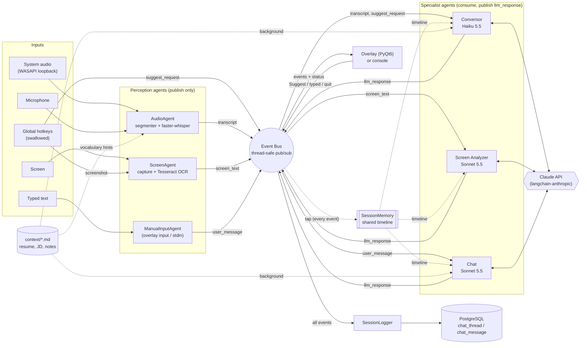
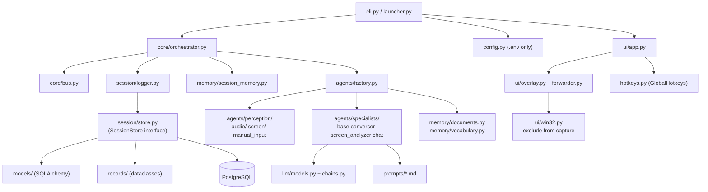
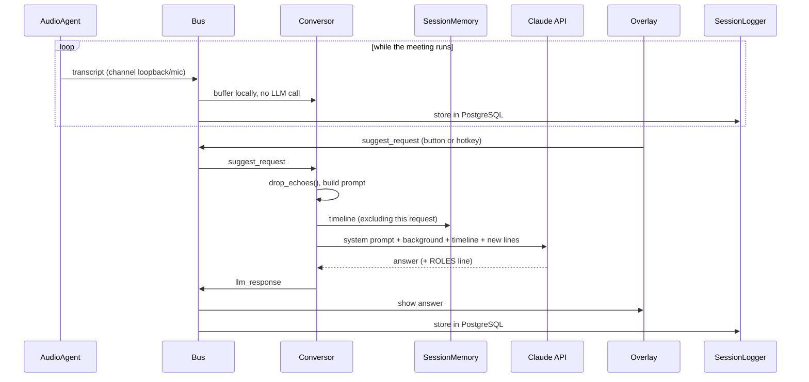
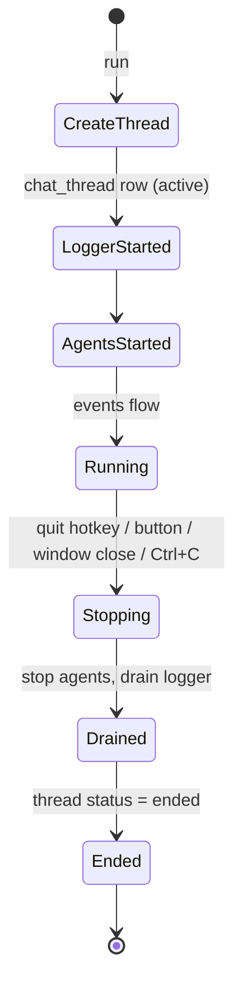
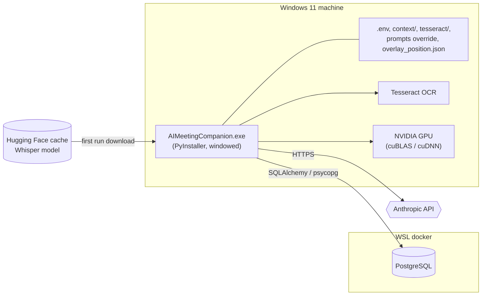

# System Design

## 1. Components and event flow

```mermaid
flowchart LR
    subgraph IN["Inputs"]
        LB["System audio<br/>(WASAPI loopback)"]
        MIC["Microphone"]
        SCR["Screen"]
        TYPED["Typed text"]
        HK["Global hotkeys<br/>(swallowed)"]
    end

    subgraph PERC["Perception agents (publish only)"]
        AUD["AudioAgent<br/>segmenter + faster-whisper"]
        SCA["ScreenAgent<br/>capture + Tesseract OCR"]
        MAN["ManualInputAgent<br/>(overlay input / stdin)"]
    end

    BUS(("Event Bus<br/>thread-safe pub/sub"))

    subgraph SPEC["Specialist agents (consume, publish llm_response)"]
        CONV["Conversor<br/>Haiku 5.5"]
        SA["Screen Analyzer<br/>Sonnet 5.5"]
        CHAT["Chat<br/>Sonnet 5.5"]
    end

    MEM[["SessionMemory<br/>shared timeline"]]
    CTX[("context/*.md<br/>resume, JD, notes")]
    LLM{{"Claude API<br/>(langchain-anthropic)"}}
    LOG["SessionLogger"]
    DB[("PostgreSQL<br/>chat_thread / chat_message")]
    UI["Overlay (PyQt6)<br/>or console"]

    LB --> AUD
    MIC --> AUD
    SCR --> SCA
    TYPED --> MAN
    HK -- "screenshot" --> SCA
    HK -- "suggest_request" --> BUS

    AUD -- transcript --> BUS
    SCA -- screen_text --> BUS
    MAN -- user_message --> BUS

    BUS -- "transcript, suggest_request" --> CONV
    BUS -- screen_text --> SA
    BUS -- user_message --> CHAT

    CONV -- llm_response --> BUS
    SA -- llm_response --> BUS
    CHAT -- llm_response --> BUS

    BUS -. "tap (every event)" .-> MEM
    MEM -. timeline .-> CONV
    MEM -. timeline .-> SA
    MEM -. timeline .-> CHAT
    CTX -. background .-> CONV
    CTX -. background .-> CHAT
    CTX -. "vocabulary hints" .-> AUD

    CONV <--> LLM
    SA <--> LLM
    CHAT <--> LLM

    BUS -- all events --> LOG --> DB
    BUS -- "events + status" --> UI
    UI -- "Suggest / typed / quit" --> BUS
```

## 2. Package layout

```mermaid
flowchart TB
    CLI["cli.py / launcher.py"] --> ORCH["core/orchestrator.py"]
    CLI --> CFG["config.py (.env only)"]

    ORCH --> BUS["core/bus.py"]
    ORCH --> LOGR["session/logger.py"]
    ORCH --> MEMM["memory/session_memory.py"]
    ORCH --> FACT["agents/factory.py"]

    FACT --> PERC["agents/perception/<br/>audio/ screen/ manual_input"]
    FACT --> SPEC["agents/specialists/<br/>base conversor screen_analyzer chat"]
    FACT --> DOCS["memory/documents.py<br/>memory/vocabulary.py"]

    SPEC --> LLMP["llm/models.py + chains.py"]
    SPEC --> PROM["prompts/*.md"]

    LOGR --> STORE["session/store.py<br/>(SessionStore interface)"]
    STORE --> ORM["models/ (SQLAlchemy)"]
    STORE --> REC["records/ (dataclasses)"]
    STORE --> PG[("PostgreSQL")]

    CLI --> UIAPP["ui/app.py"]
    UIAPP --> OVL["ui/overlay.py + forwarder.py"]
    UIAPP --> HKS["hotkeys.py (GlobalHotkeys)"]
    OVL --> WIN["ui/win32.py<br/>exclude from capture"]
```

## 3. Suggest request sequence (Conversor)

```mermaid
sequenceDiagram
    participant Audio as AudioAgent
    participant Bus
    participant Conv as Conversor
    participant Mem as SessionMemory
    participant LLM as Claude API
    participant UI as Overlay
    participant Log as SessionLogger

    loop while the meeting runs
        Audio->>Bus: transcript (channel loopback/mic)
        Bus->>Conv: buffer locally, no LLM call
        Bus->>Log: store in PostgreSQL
    end

    UI->>Bus: suggest_request (button or hotkey)
    Bus->>Conv: suggest_request
    Conv->>Conv: drop_echoes(), build prompt
    Conv->>Mem: timeline (excluding this request)
    Conv->>LLM: system prompt + background + timeline + new lines
    LLM-->>Conv: answer (+ ROLES line)
    Conv->>Bus: llm_response
    Bus->>UI: show answer
    Bus->>Log: store in PostgreSQL
```

## 4. Session lifecycle

```mermaid
stateDiagram-v2
    [*] --> CreateThread: run
    CreateThread --> LoggerStarted: chat_thread row (active)
    LoggerStarted --> AgentsStarted
    AgentsStarted --> Running: events flow
    Running --> Stopping: quit hotkey / button / window close / Ctrl+C
    Stopping --> Drained: stop agents, drain logger
    Drained --> Ended: thread status = ended
    Ended --> [*]
```

## 5. Deployment

```mermaid
flowchart LR
    subgraph WIN["Windows 11 machine"]
        EXE["AIMeetingCompanion.exe<br/>(PyInstaller, windowed)"]
        FILES[".env, context/, tesseract/,<br/>prompts override, overlay_position.json"]
        TESS["Tesseract OCR"]
        GPU["NVIDIA GPU<br/>(cuBLAS / cuDNN)"]
        EXE --- FILES
        EXE --> TESS
        EXE --> GPU
    end
    subgraph WSL["WSL docker"]
        PG[("PostgreSQL")]
    end
    ANTH{{"Anthropic API"}}
    HF[("Hugging Face cache<br/>Whisper model")]

    EXE -->|SQLAlchemy / psycopg| PG
    EXE -->|HTTPS| ANTH
    HF -->|first run download| EXE
```
